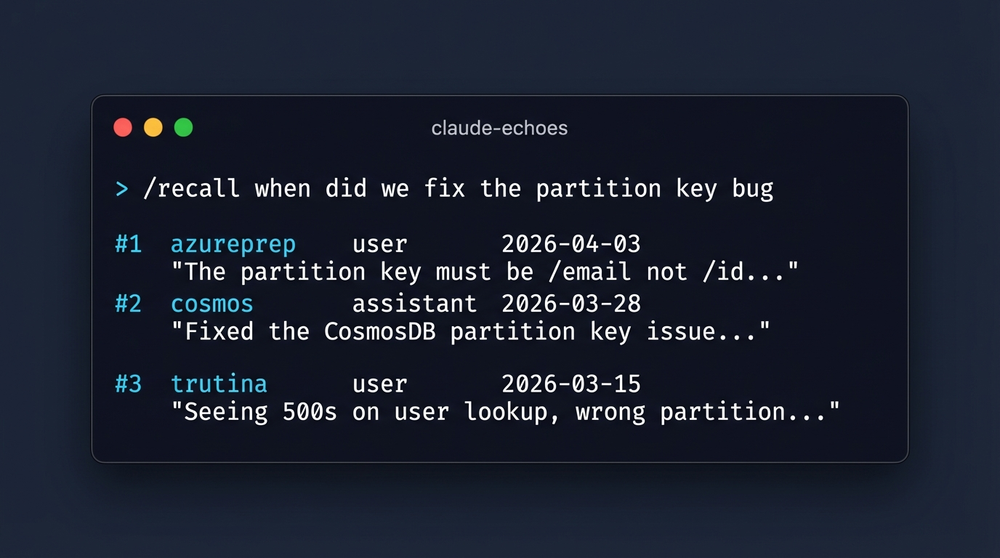

# claude-echoes

<p align="center">
  
</p>

**Verbatim semantic memory for Claude Code sessions.**
Every prompt, every response, every project — searchable by meaning, across every session you've ever run. Self-hosted. Free. ~10 minutes to install.

> *"I ran three sessions yesterday on the same project. Which one fixed the bug?"*
> Echoes answers that question in 200ms, in plain English, from your verbatim history.

**Benchmarked honestly.** **86.4% on [LongMemEval](https://github.com/xiaowu0162/LongMemEval)** (ICLR 2025) with Sonnet 4.6 - pgvector cosine + BM25 RRF hybrid + temporal re-ranking + LLM re-ranker. **100% on single-session-user retrieval** (70/70). Full per-category breakdown, raw outputs, and reproduction steps in [benchmarks/](benchmarks/). No hardcoded answer patterns. No invented terminology. No cherry-picking.

**What the SERVER runs, as of 2026-08-29.** `/search` runs pgvector cosine and Postgres full-text fused with RRF, then, **optionally, a local LLM re-ranker** (`qwen2.5:7b-instruct` on ollama - no data leaves the machine). The re-ranker is **off by default** and needs the GPU override. It still has **no temporal re-ranking**, and the 86.4% figure was measured by [benchmarks/run_longmemeval.py](benchmarks/run_longmemeval.py) with a cloud model, so treat it as the ceiling of the approach rather than the score of the service you get from `docker compose up`. A 3B judge measured *worse* than no re-ranker at all, so do not swap the model down to fit VRAM. What the service scores is in [docs/graded-eval-2026-08-30.md](docs/graded-eval-2026-08-30.md), measured on a generated 67-case set against a real 108,570-message archive: **single-session Recall@5 0.545 with the re-ranker on, 0.500 without** (re-measured 2026-09-10). Abstention is **0.000** either way - `/search` has no score floor, so a question about a subject absent from the corpus still returns five confident rows. [scripts/eval_retrieval.mjs](scripts/eval_retrieval.mjs) is a 7-case **smoke test**, not a benchmark - it was written by the session that built the retriever, so it selected for what the retriever could already serve, and its 6/7 overstated retrieval by roughly 2x. Do not settle a ranking decision on it.

---

## What it does

Claude Code is great at one session. It has no idea what happened in the last one.

Echoes captures every user prompt and assistant response as you work, stores them in Postgres with [pgvector](https://github.com/pgvector/pgvector) embeddings from a local [Ollama](https://ollama.com/) model (`nomic-embed-text`, 768-dim), and exposes a `/recall` skill inside Claude Code so you can ask:

```
/recall when did we fix the partition key bug
/recall cors issue with azure functions --project azureprep
/recall vercel deployment failure --days 7
```

and get the actual verbatim conversation back — with project, role, date, and a session ID so you can pull the surrounding context.

**No summarisation. No LLM deciding what's "important." No vendor lock-in. No cloud.**

Your data stays on your machine (or your VPS). The embedding model is a 137M-parameter local model. Retrieval is a single SQL query against an HNSW index. The entire thing is ~600 lines of Python + 200 lines of JavaScript.

---

## Why not just use [MemPalace](https://github.com/milla-jovovich/mempalace) / ChromaDB / [your favourite]?

Honest comparison:

| | claude-echoes | MemPalace | mem0 / letta |
|---|---|---|---|
| Claude Code hook integration | Native, single-file JS hook | No | No |
| Storage | Postgres + pgvector | ChromaDB | Varies |
| Embedding model | Local Ollama (free, no API) | Local | Usually OpenAI |
| Cross-session semantic recall | Yes | Yes | Yes |
| Install time | ~10 min (one docker-compose) | ~30 min | Varies |
| Designed for Claude Code specifically | Yes | No | No |
| Summarises / extracts "important" bits | **No — verbatim only** | No | Yes |
| LongMemEval_S score | **86.4%** (Sonnet) / **76.8%** (Haiku) - [reproducible](benchmarks/) | [96.6% claimed](https://x.com/banteg/status/2041427374487605614) (disputed) | Not reported |
| Lines of code | ~800 + ~600 benchmark | ~3000+ | Large |

If you already run a Postgres and don't use Claude Code, MemPalace is probably better for you. If you live in Claude Code all day and keep losing context between sessions, this is built for you.

---

## Quick start

**Requires:** Docker, a Claude Code install, and either Linux, macOS, or Windows (WSL2 or Git Bash).

```bash
git clone https://github.com/m4cd4r4/claude-echoes.git
cd claude-echoes
./scripts/install.sh
```

The installer will:

1. Spin up Postgres 15 + pgvector and Ollama via `docker-compose`
2. Pull the `nomic-embed-text` model (~275MB)
3. Apply the schema migration
4. Install the Claude Code hook into `~/.claude/hooks/claude-echoes/`
5. Install the `/recall` skill into `~/.claude/skills/recall/`
6. Print a test command to verify

Total time: ~10 minutes (most of which is pulling the ollama model).

After install, **just use Claude Code normally.** Every prompt and response is captured and embedded in the background with zero added latency. Within a few sessions, `/recall` starts returning useful results.

---

## Usage

Inside any Claude Code session:

```
/recall <natural language query>
```

Filters:

```
/recall <query> --project <name>       # limit to one project
/recall <query> --days <N>              # only messages from last N days
/recall <query> --role user|assistant   # filter by sender
/recall <query> --limit <N>             # how many hits (default 10)
```

Or call the HTTP API directly:

```bash
curl "http://localhost:8088/search?q=how+did+we+fix+the+auth+bug&limit=5"
```

---

## Architecture

```
                   ┌─────────────────┐
                   │   Claude Code   │
                   │   (your IDE)    │
                   └────────┬────────┘
                            │ UserPromptSubmit / Stop hook
                            ▼
                   ┌─────────────────┐
                   │  chat-logger.js │  (hooks/chat-logger.js, ~150 LOC)
                   └────────┬────────┘
                            │ POST /message
                            ▼
                   ┌─────────────────┐
                   │ echoes-server   │  (server/app.py, ~200 LOC)
                   │    FastAPI      │◄──────┐
                   └────┬───────┬────┘       │
                        │       │            │
         embed on insert│       │search      │GET /search?q=...
                        ▼       ▼            │
                 ┌──────────┐ ┌──────────┐   │
                 │  Ollama  │ │ Postgres │   │
                 │  nomic-  │ │ + HNSW   │   │
                 │  embed   │ │ pgvector │   │
                 └──────────┘ └──────────┘   │
                                             │
                   ┌─────────────────┐       │
                   │  /recall skill  │───────┘
                   │  (SKILL.md)     │
                   └─────────────────┘
```

**Flow on every message:**
1. Claude Code fires `UserPromptSubmit` or `Stop` hook event
2. `chat-logger.js` POSTs the message to `http://localhost:8088/message`
3. Server calls Ollama to embed the content (~150ms, in-process)
4. Server inserts `(session_id, project, role, content, embedding)` into Postgres
5. Total latency: ~200ms, fully async, never blocks your prompt

**Flow on `/recall`:**
1. You type `/recall <query>` in any session
2. Skill calls `GET /search?q=<query>&...filters`
3. Server embeds the query, runs `ORDER BY embedding <=> $1::vector LIMIT N` against the HNSW index
4. Returns ranked hits with full verbatim content + metadata
5. Claude renders them with similarity scores and project/date context

---

## What Echoes deliberately does *not* do

- **It does not summarise.** Your history is verbatim. If you want a summary, ask Claude to summarise the recall results.
- **It does not decide what's "important."** Every message is kept. Storage is cheap.
- **It does not sync to any cloud.** Your data never leaves the machine running the server.
- **It does not modify Claude Code itself.** It's a hook + a skill + a local HTTP service. Remove the three files and it's gone.
- **It does not require an API key.** No OpenAI, no Anthropic, no Cohere. Local embeddings only.

---

## Running on a shared VPS (optional)

If you want echoes accessible from multiple machines (laptop + desktop + WSL), point the hook's `ECHOES_URL` env var at a remote server instead of `localhost:8088`. The server is stateless; just run the docker-compose on your VPS, expose port 8088 behind an authenticated reverse proxy, and set a shared API key.

See [docs/remote-deployment.md](docs/remote-deployment.md) for a working nginx + auth config.

> **Privacy note:** if you go remote, use TLS + auth. Your verbatim prompts contain everything you've said to Claude across every project. Treat the database like you would a password vault.

---

## Backfilling from existing chat history

If you have older Claude Code session logs in `~/.claude/daily-logs/` or any other format, the `scripts/backfill.py` script will read them and embed them in batches. See [docs/backfill.md](docs/backfill.md).

---

## Requirements

- Docker + docker-compose
- Claude Code (any recent version with hook support)
- ~1GB disk for the base stack (Postgres + nomic-embed-text + a year of chat
  history), plus 4.7GB if you enable the LLM re-ranker
- ~2GB RAM for the base stack
- **Base stack is CPU-only** — no GPU required for logging and search. On a
  modest VPS, embedding takes ~150ms per message.
- **The LLM re-ranker needs a GPU.** It is `qwen2.5:7b-instruct`, and a 7B judge
  on CPU is not viable; the 3B that would be measured *worse* than no re-ranker.
  It ships OFF (`ECHOES_RERANK=0`) and is enabled by the GPU override — see
  [docker-compose.gpu.yml](docker-compose.gpu.yml). A backfill of a large archive
  also wants the GPU: CPU embedding puts 108k messages at about 99 hours.

---

## Roadmap

Short list, in priority order:

- [ ] Team mode: shared memory across multiple devs working on the same repo
- [ ] SQLite + sqlite-vec backend for single-machine minimal installs
- [ ] Web UI for browsing and exporting history
- [ ] Session replay: reconstruct the full conversation from any hit
- [ ] Prompt-level clustering for "what am I working on most?"

**Not on the roadmap:** hosted SaaS (yet), auto-summarisation, LLM-based "smart memory," vendor cloud integrations.

---

## Background

Built in a weekend by [@m4cd4r4](https://github.com/m4cd4r4) after getting tired of running 5+ parallel Claude Code sessions per day and losing track of which session fixed what. The core capture pipeline started as a private side-project on an existing Brain API, then got extracted, cleaned up, and open-sourced once the retrieval half worked well enough to be worth sharing.

The embedding + search stack is boringly conventional: pgvector HNSW + `nomic-embed-text` via Ollama. The value isn't the retrieval — it's the wiring into Claude Code with zero friction.

---

## Contributing

Issues and PRs welcome. For anything non-trivial, open an issue first so we can talk through the design. The project aims to stay under 1000 LOC of core code forever.

---

## License

MIT. See [LICENSE](LICENSE).
